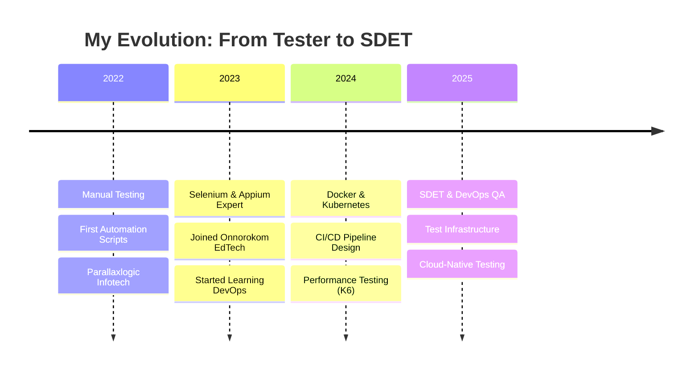

<div align="center">
  
</div>

<h1 align="center">
  
</h1>

<!-- HERO BADGES -->
<div align="center">
  
  
  
  
</div>

<br>

<div align="center">
  <a href="https://www.linkedin.com/in/frabbii/"></a>
  <a href="mailto:frabbif96@gmail.com"></a>
  <a href="https://github.com/Rabbii96"></a>
  
</div>

---

<!-- UNIQUE VALUE PROPOSITION -->
<div align="center">
  <table>
    <tr>
      <td align="center" width="50%">
        <h3>❌ What Most QA Engineers Do</h3>
        <p>Test → Find Bugs → Report → Wait → Retest</p>
      </td>
      <td align="center" width="50%">
        <h3>✅ What I Do</h3>
        <p>Commit → Auto-Test → Pass/Fail in Minutes → Ship</p>
      </td>
    </tr>
  </table>
</div>

---

## 🚀 **The Engineer Who Bridges QA & DevOps**


```typescript
const fazleRabbi = {
    role: "SDET & DevOps QA Engineer",
    experience: "3+ years",
    currentCompany: "Onnorokom Edtech Ltd",
    
    whatIDo: [
        "Build test infrastructure on Kubernetes",
        "Design CI/CD pipelines with quality gates",
        "Automate what others test manually",
        "Catch bugs before they reach production"
    ],
    
    philosophy: "Quality isn't a phase — it's a pipeline feature",
    
    superpower: "QA mindset + DevOps tools = Fearless releases"
};
```

<br>

### 🎯 **Why I'm Different**

> *"I got tired of being the last checkpoint before disaster. So I learned to shift quality left — into the infrastructure itself."*

<br clear="right"/>

---

## 💼 **Impact Dashboard**

<div align="center">
  <table>
    <tr>
      <td align="center">
        
        <br><sub>Designed & Executed</sub>
      </td>
      <td align="center">
        
        <br><sub>Production Ready</sub>
      </td>
      <td align="center">
        
        <br><sub>Regression Time ↓</sub>
      </td>
      <td align="center">
        
        <br><sub>Maintained</sub>
      </td>
    </tr>
    <tr>
      <td align="center">
        
        <br><sub>Defect Reduction</sub>
      </td>
      <td align="center">
        
        <br><sub>Delivered</sub>
      </td>
      <td align="center">
        
        <br><sub>Team Growth</sub>
      </td>
      <td align="center">
        
        <br><sub>440/400 marks</sub>
      </td>
    </tr>
  </table>
</div>

---

## 🛠️ **Technical Arsenal**

<div align="center">

### **🧪 Test Automation**


### **🐳 DevOps & Infrastructure**


### **⚡ Performance Testing**


### **🔄 CI/CD Pipeline**


### **💻 Programming**


</div>

---

## 📈 **Career Journey**



---

## 💼 **Professional Experience**

###  **Software QA Engineer** | *Aug 2023 - Present*

<details>
<summary><b>🔥 Click to see what I built here</b></summary>
<br>

| What I Did | Impact |
|------------|--------|
| Led automation for web & mobile apps | 150+ test cases with **Selenium & Appium** |
| Implemented K6 performance testing | Identified bottlenecks before production |
| Designed CI/CD quality gates | **30% faster** regression cycles |
| Built containerized test environments | **Docker + K8s** for consistent testing |
| Mentored junior QA engineers | Team efficiency improved by **15%** |
| Reduced production defects | **20% fewer** critical bugs |

</details>

###  **QA Specialist Engineer** | *Jun 2022 - Jul 2023*

<details>
<summary><b>🔥 Click to see my foundation work</b></summary>
<br>

| What I Did | Impact |
|------------|--------|
| Delivered 5+ client projects | Web, API & Mobile testing |
| Executed 300+ test cases | **95%** execution rate |
| Implemented automation frameworks | **40% less** manual effort |
| Cross-browser testing | **10% fewer** compatibility issues |

</details>

---

## 🏆 **Featured Project: Award-Winning Capstone**

<div align="center">
  
</div>

<div align="center">
  <table>
    <tr>
      <td align="center">🎯 <b>Score</b><br><code>440/400</code><br>(110%)</td>
      <td align="center">📋 <b>Test Scenarios</b><br><code>79</code></td>
      <td align="center">🌐 <b>Cross-Browser Tests</b><br><code>474</code></td>
      <td align="center">⚡ <b>Features Covered</b><br><code>8</code></td>
    </tr>
  </table>
</div>

```
Tech Stack: Playwright + Node.js + Page Object Model
Browsers: Chrome | Firefox | Edge | Safari | Mobile
```

<details>
<summary><b>📂 More Projects</b></summary>

| Project | Tech | Impact |
|---------|------|--------|
| **Cypress E2E** - Computer Village | Cypress, JavaScript, POM | Full registration & login automation |
| **Appium Mobile** - Praava Health | Appium, Cross-platform | **25% faster** test execution |
| **Selenium Web** - Tadex Platform | Java, Selenium, TestNG | **35%** efficiency increase |
| **K6 Performance** - Load Testing | K6, JavaScript | Production bottleneck identification |

</details>

---

## 📊 **GitHub Analytics**

<div align="center">
  
  
</div>

<div align="center">
  
</div>

<div align="center">
  
</div>

---

## 🎯 **What I'm Looking For**

<div align="center">
  <table>
    <tr>
      <td align="center">
        <h3>🔥 Open To</h3>
        <code>SDET</code><br>
        <code>DevOps QA Engineer</code><br>
        <code>Test Infrastructure Engineer</code><br>
        <code>Platform QA Engineer</code>
      </td>
      <td align="center">
        <h3>🌍 Work Style</h3>
        <code>Remote</code> ✅<br>
        <code>Hybrid</code> ✅<br>
        <code>Relocation</code> ✅
      </td>
      <td align="center">
        <h3>💡 I Bring</h3>
        <code>QA + DevOps Skills</code><br>
        <code>Test Infrastructure</code><br>
        <code>Pipeline Integration</code><br>
        <code>Team Mentorship</code>
      </td>
    </tr>
  </table>
</div>

---

## 🤝 **Let's Build Something Reliable Together**

<div align="center">
  <a href="https://www.linkedin.com/in/frabbii/" target="_blank">
    
  </a>
  <a href="mailto:frabbif96@gmail.com" target="_blank">
    
  </a>
  <a href="https://wa.me/8801521315133" target="_blank">
    
  </a>
</div>

<br>

<div align="center">
  
</div>

---

<div align="center">
  
  
  
  
  <br><br>
  
  **⚡ "I don't just find bugs — I build systems that make bugs impossible." ⚡**
  
  <br>
  
  <sub>Built with 💚 by <a href="https://github.com/Rabbii96">Fazle Rabbi</a> | SDET & DevOps QA Engineer</sub>
  
</div>
